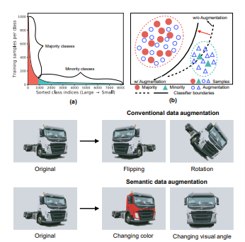

<table border=1 width=400>
    <tr>
        <td width=160>
        
        </td>
        <td width=240>
        We propose a novel approach to learn transformed semantic directions with meta-learning automatically. In specific, the augmentation strategy during training is dynamically optimized, aiming to minimize the loss on a small balanced validation set, which is approximated via a meta update step. Extensive empirical results on CIFAR-LT-10/100, ImageNet-LT, and iNaturalist 2017/2018 validate the effectiveness of our method. 
        </td>
    </tr>
</table>
